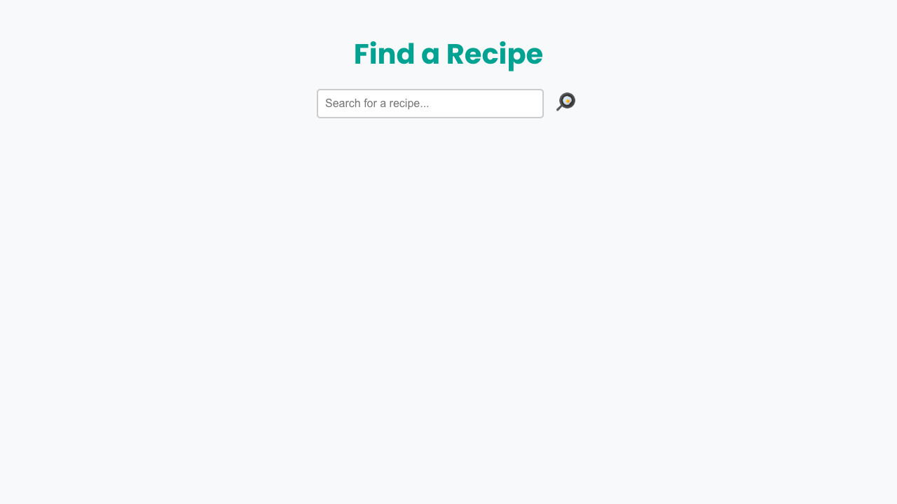
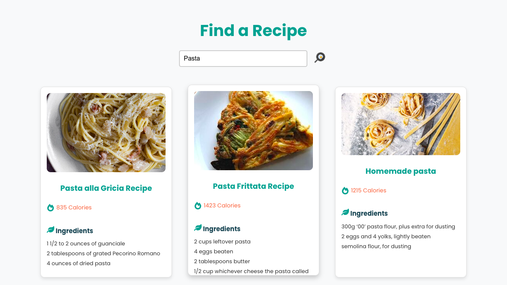

# **Recipe Finder**

The **Recipe Finder** is a simple and interactive web application that allows users to search for delicious recipes by entering keywords. It fetches data from the Edamam API and displays recipes with details like images, ingredients, and calorie information.

---

## **Features**
- **Search Recipes:** Enter a keyword (e.g., "chicken," "pasta") to search for recipes.
- **Calorie Information:** See the total calories for each recipe.
- **Ingredients List:** Get a detailed list of ingredients for each recipe.

---

## **API Integration**
The application uses the **Edamam Recipe API** for fetching recipe data.  
To use the app, the following credentials are required:
- **App ID:** Provided by Edamam.
- **App Key:** Provided by Edamam.

---

## **Technologies Used**
- **React:** Component-based architecture for dynamic and reusable UI.
- **CSS:** Styled components for modern and responsive design.
- **Edamam API:** For retrieving recipe data.
- **React Icons:** For visually enhancing the app with icons.

---
## **Screens and Descriptions**

### **1. Home Page**
- **Description:**
  - Users can search for recipes by typing a keyword into the search bar.
  - The search button features a frying pan icon for a visually appealing interface.
- **Features:**
  - Dynamic search input field.
  - Fetches recipes based on the user's input.

---

### **2. Recipe Display Page**

- **Description:**
  - Displays recipes in a grid format, with three recipes per row.
  - Each recipe card includes:
    - Recipe image.
    - Recipe name.
    - Total calories.
    - List of ingredients.
  - Hover effects highlight the recipe card for better interactivity.
- **Features:**
  - Scrollable ingredients list for recipes with many components.
  - Modern icons for calories and ingredients enhance the user experience.
